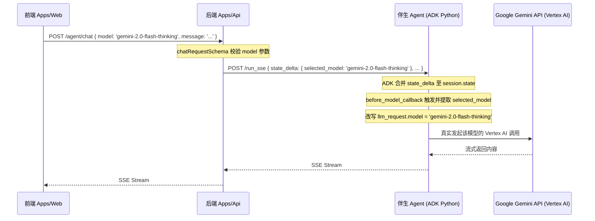

# aquablue-monorepo 全局开发与 AI 协作规范 (GEMINI.md)

本文件定义了 `aquablue-monorepo` 仓库的全局开发准则、AI 行为 discipline 以及两个子应用（`apps/api` 与 `apps/web`）的开发规范。

> [!IMPORTANT]
> 任何 AI Agent（如 Antigravity）在进行代码编写、重构或审阅前，必须完整阅读并始终严格遵循本文件定义的原则和工作流。

---

## 1. 🗣 沟通与协作规范 (Communication & Agent Rules)

- **回复语言**: 默认使用**中文**，技术术语保留英文原文（如 "Worktree"、"Edge Runtime"、"TDD" 等）。
- **代码注释**: 强制使用**英文**。
- **Git Commit 格式**: 使用英文 + **Conventional Commits**（例如 `feat:`, `fix:`, `refactor:`, `chore:`, `docs:`, `test:`）。
- **Karpathy 纪律**:
  1. **不确定就问，不猜**：遇到多种解读或不确定的库版本及接口时，列出选项供用户选择。
  2. **最小化外科手术式修改**：只改必须改的代码，切勿无意义重排版、修改无关注释或引入未要求的修改。
  3. **目标驱动与验证先行**：完成工作前，必须提供真实的构建或测试成功日志，作为判定完成的标准。
  4. **复杂任务先出计划**：涉及多文件/多组件/架构变更时，必须先提交实施计划获批后再动手。

---

## 2. 🚫 核心开发红线 (Critical Red Lines)

引用自根目录 [rules.md](file:///Users/yl/gemini/hackathon/gemini-hackathon/in-play/rules.md) 的铁律，严禁触碰：

1. **GCP 部署与运行期**: 前端 `apps/web` 与后端 `apps/api` 均计划部署在 GCP (Google Cloud Run) 的标准 Node.js 运行期环境。支持使用 Node.js 原生模块，但仍需保持代码高内聚与职责分离，避免不必要的底层耦合。
2. **强制使用 Bun**: 所有包管理及脚本执行必须使用 `bun`（如 `bun add`, `bun run dev`）。严禁推荐或调用 `npm`/`yarn`/`pnpm`。
3. **消除 any 与裸 console.log**: 
   - 绝不允许使用 `any` 类型（类型不确定时使用 `unknown`）。
   - 禁止在代码中写 `console.log`，必须使用带有结构化功能的日志库（如前端/后端引入的 `pino` 或专门包装的 logger）。
4. **前端禁止 Naked Fetch**: 
   - 严禁在 React 组件中直接写 `useEffect(() => { fetch(...) })` 获取远端数据。
   - 必须使用 **TanStack Router `loader`** 进行预加载（以确保 SSR 首屏性能），并结合 **TanStack Query `useSuspenseQuery`** 实现数据流绑定与脱水/注水。
5. **禁止手动修改 Route Tree**: 绝对不允许手动修改 `apps/web/src/routeTree.gen.ts` 文件，一切路由均由 TanStack Router 自动扫描生成。
6. **代码高内聚与职责分离**:
   - 禁止将业务逻辑直接写入路由声明文件或全局页面挂载中（禁止 "All-in-One" 文件）。

---

## 3. 🛠 开发命令与工具链 (Command Reference)

在根目录下可使用以下命令统一调度多包项目：

- **开发启动**: 
  - 启动全部应用: `bun run dev`
  - 仅启动前端: `bun run dev:web`
  - 仅启动后端: `bun run dev:api`
- **编译打包**:
  - 打包全部应用: `bun run build`
  - 仅打包前端: `bun run build:web`
  - 仅打包后端: `bun run build:api`
- **运行测试**:
  - 执行所有单元与集成测试: `bun run test`
- **更新依赖**:
  - 安全更新全部工作区依赖: `bun run update`

---

## 4. 🗄 后端 API 规范 (`apps/api` - Hono.js)

针对基于 GCP Cloud Run 的 Hono.js API 体系，强制执行以下约束：

### 四层路由架构规范
每个业务模块应独立在 `src/routes/<module>/` 文件夹中开发，严格遵循以下 4 文件隔离分层：
1. **`<module>.routes.ts`**: 仅通过 `@hono/zod-openapi` 中的 `createRoute()` 定义 API Contract（路由路径、HTTP 方法、Zod Schema 以及全部响应状态码如 200, 400, 404, 500）。**禁止包含任何业务逻辑**。
2. **`<module>.handlers.ts`**: 仅实现具体的业务逻辑，接收 context，提取数据，调用服务和数据库（Firestore），并打印 Pinot 日志。其上下文类型应从 `routes.ts` 的路由声明中自动推断。
3. **`<module>.index.ts`**: 用 `createRouter()` 装配 routes 和 handlers，是唯一的连接层。
4. **`<module>.test.ts`**: 编写基于真实数据库环境的 Vitest 集成测试。

### 错误处理
- 统一管理在 `src/lib/errors.ts`，使用 `ERROR_CODES` 进行分类描述（如 `CATEGORY_REASON`）。返回错误必须使用标准化包装函数 `createErrorResponse`。

---

## 5. 🎨 前端 Web 规范 (`apps/web` - TanStack Start)

针对基于 TanStack Start 的 React 19 GCP 全栈 SSR 体系，强制执行以下约束：

### 特性驱动架构 (Feature-Driven)
- 代码必须封装在 `src/features/<feature-name>/` 中，包括其特有的组件、hooks、API 调用和类型。
- `src/routes/` 仅作为一个轻量级的路由定义与 Feature 装配图层。

### UI 系统与样式约束
- 使用 **Tailwind CSS v4** 作为样式引擎（无 `tailwind.config.js`，全部通过 CSS 变量和 `@theme` 扩展）。
- 基础组件推荐直接采用封装好的组件（原 HeroUI v3 组件，未来或演进为 shadcn）。
- 绝不能手写内联 `style`，间距和配色需统一映射自全局 Design System tokens。

### 表单管理与校验
- 所有复杂表单状态必须通过 `@tanstack/react-form` 配合 Zod 校验进行管理。
- 编写表单前，AI Agent 必须主动挂载并阅读 `tanstack-form` 相关的开发技能。

### 国际化 (i18n) 与 SSR
- 所有面向用户的文本必须经过 `useTranslations()` 进行国际化包装。
- 对于全局 Error Boundary 或 Pending Fallback，**严禁在渲染中动态调用 i18n 探测函数**，以避免引发致命的 SSR 客户端 Hydration Mismatch（注水冲突）崩溃。

### GCP (Google Cloud Run) 部署与编译适配铁律

> 💡 **架构决策与避坑指南**：
> - 关于多容器 (Sidecar) 架构的设计细节，请参阅 [ADR 0010](file:///Users/yl/gemini/hackathon/gemini-hackathon/in-play/docs/adr/0010-multi-container-gcp-deployment.md)。
> - 关于完整部署步骤与踩坑细节，请参阅 [GCP 部署与避坑踩坑指南](file:///Users/yl/gemini/hackathon/gemini-hackathon/in-play/docs/gcp-deployment-guide.md)。

前端编译为可在 Google Cloud Run (Node.js 运行期) 上运行的容器，必须严格遵循以下规约：
1. **`index.html` 占位文件**：必须在 `apps/web/` 根目录下保留 `index.html` 模板文件，以确保 Vite 对客户端路由进行 SSR 打包时能够顺利编译。
2. **构建与启动脚本的 `bunx` 隔离**：由于 Monorepo 将所有依赖包提升至根目录 `node_modules` 下，子应用 `package.json` 中的构建脚本必须使用 `bunx`（如 `"build": "bunx vinxi build..."`），以确保能正确向上沿着父路径寻得 `vinxi` 命令。
3. **Nitro 运行期启动入口**：生产环境启动命令使用 `"start": "node .output/server/index.mjs"`，绕开 vinxi CLI 直连 Nitro 服务，最节约容器冷启动内存。

---

## 6. 🧪 统一测试规约 (Testing & TDD)

- **挂载依赖**: 在编写或修改测试代码前，AI 必须主动挂载并参考 `javascript-testing-patterns` 和 `vitest` 技能。
- **后端测试 (Vitest)**:
  - 强制运行在独立的测试数据库环境（如配置 `.env.test`），绝不允许直接读写开发/生产数据库。
  - 通过 `testClient` 实现类型安全的端到端测试，严禁使用 `as any` 强制转换击穿类型保护。
  - 全局拦截 `globalThis.fetch`，使内网或内端点（如 JWKS 接口）调用能够无痛重定向回内存中的路由。
- **前端测试 (Happy DOM)**:
  - 项目统一使用 `happy-dom` 作为测试执行环境。
  - 重视 React Aria / 指针事件兼容，测试时优先选用 `@testing-library/user-event` 的 `.click()` 代替 `fireEvent` 模拟真实交互。
  - **运行器限制 (核心警告)**: 运行测试必须使用 `bun run test` (即调用 `vitest`)。**严禁直接使用原生 `bun test` 命令**，因为 Bun 原生测试运行器不会加载前端 `vitest.config.ts` 中的 `happy-dom` 环境配置，这会导致全局 `document` 未定义，并使 `user-event` 在初始化时无限卡死。

---

## 7. 📡 可观测性规范 (Observability)

- **跨栈串联 (X-Request-Id)**: 每个外部请求在网关或首层中间件进入时都将获得唯一的 UUID 标识。所有响应头以及前端/后端所生成的 Pino 结构化日志必须统一包含 `X-Request-Id` 以进行全链路追踪。
- **异常捕获与追踪**: 通过标准 SDK（如 Sentry 或 GCP Cloud Logging/Trace）进行追踪，且在配置中**绝不允许**启用 `sendDefaultPii: true` 泄露用户个人信息。

---

## 8. 🤖 动态模型路由与切换规范 (Dynamic Model Routing)

为了避免前端、后端以及 Python 伴生 Agent 之间静态硬编码模型导致推理模式单一和模型过时的问题，系统实现了基于 `state_delta` 的动态模型路由架构。

### 架构设计与调用链

### 支持与推荐的最新 Gemini 模型列表
当修改前端下拉菜单或新增系统支持时，必须使用且仅允许以下最新官方模型 ID：
* **`gemini-2.5-flash`**：默认模型，速度快，适合轻量级任务和快速代码试运行。
* **`gemini-2.5-pro`**：适合深度的系统级分析、复杂逻辑编写和大型 Applet 编译任务。
* **`gemini-2.0-flash-thinking`**：提供长推理思考链展示（Reasoning Chain），在解决复杂 bug 和拆解高级工作流时能展示思考路径。
* **`gemini-2.0-flash`**：提供极低延时的轻量智能推理。

### 伴生 Agent 修改规范
伴生 Agent 必须在 `app/agent.py` 的 `Agent` 实例化时注册 `before_model_callback`，绝对不允许在 `Gemini(model=...)` 中硬编码单一模型作为不可更改的唯一推理模型。所有动态改写必须基于 `callback_context.state` 来实现高内聚和动态决策。

---

## 9. ⚠️ 经典踩坑记录与防错开发规约 (Pitfalls & Prevention)

以下是全栈联调与 AI 自动化执行中沉淀的核心避坑经验，后续开发必须严格遵循：

### 1. MockFirestore 数据易失防范
* **痛点**：本地开发如未配置 Firestore 模拟器，服务将回退至 `in-memory MockFirestore`。每次重启 API 后端或 Vite 触发热重载都会彻底清空内存数据。
* **开发规约**：
  * **启动自动挂载**：在 `manage.sh` 中配置在服务初始化后自动执行 `save-github-token.ts` 和 `save-google-key.ts` 等本地脚本，强注入默认密钥。
  * **环境变量 Fallback**：后端 API 处理函数（如 `/agent/chat`）读取凭证时，如发现数据库记录为空，应自动尝试从宿主主机的 `process.env.GITHUB_TOKEN` 等环境变量进行 fallback。

### 2. 移除大模型 Tool 定义中的敏感凭证参数
* **痛点**：在定义 Python ADK 伴生工具时，如将 `github_token` 等密钥定义为 LLM 可直接感知的入参，当会话状态不准时大模型极易传入空字串，或者将用户的历史普通输入误填入该字段，导致接口鉴权瞬间崩塌。
* **开发规约**：
  * 任何敏感 Token 均**禁止**定义在 LLM 可见的 Tool 签名中。
  * 必须使用 `tool_context: ToolContext`，由 Python 伴生端在工具被触发后，自动从 `tool_context.state.get("user_credentials", {})` 或环境变量中隐式提取并拼接至请求 Payload，使敏感凭证对大模型绝对黑盒。

### 3. 子进程 Exit Code 击穿引发 Hono 500 Unhandled Error
* **痛点**：后端调用 shell（如 `execSync("git clone...")`）抛出子进程错误时，Error 对象会带上 exit code 的 `status` 字段（如 128 或 129）。Hono 会默认读取 `error.status` 作为响应状态码抛出给客户端。然而 128 不符合合法 HTTP 码区间 `[200, 599]`，会直接导致 `@hono/node-server` 崩溃并丢出 `RangeError: The status provided must be in range of [200, 599]`，从而把真实的业务异常信息吞掉。
* **开发规约**：
  * 任何使用 `execSync` 或 `spawnSync` 调起外部进程的封装类（例如 `GitCacheManager`），在捕获异常时必须重新包裹 Error，显式强制指定合法的 HTTP 代码状态（如 `wrappedError.status = 500`），绝不允许将外部进程的非标 exit code 作为 error.status 状态溢出暴露给 Hono。

### 4. DOM 仿真测试中的同名 CSS Selector 碰撞
* **痛点**：在前端渲染中，页面中可能同时存在多个 `input` 元素（例如 A2UI 表单里的密码框与底部的 Chat 输入框）。如果只用宽泛的选择器（如 `input.flex-1`）进行 query，`querySelector` 只会无脑匹配第一个，导致按键模拟写入到错误的输入框，甚至将普通对话内容当做 Token 发给后端鉴权接口。
* **开发规约**：
  * 所有前端测试与仿真脚本，必须使用高精确度的特化选择器（例如聊天框定位：`input[type="text"]` 或带有明确 ID 的 selector），禁止使用样式向的通用 util class 作为交互唯一索引。
