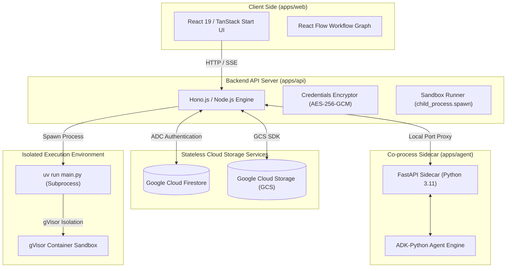
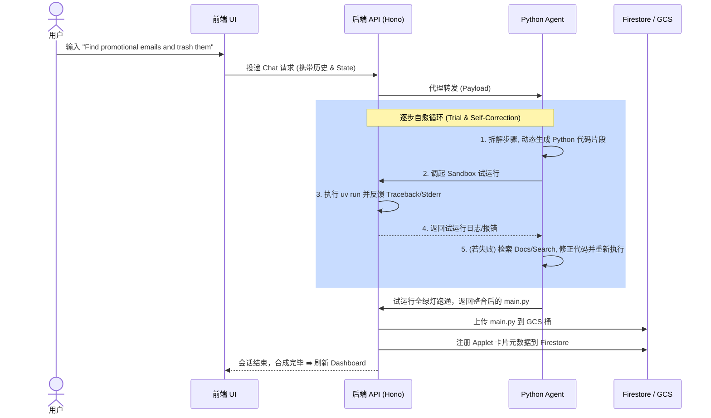
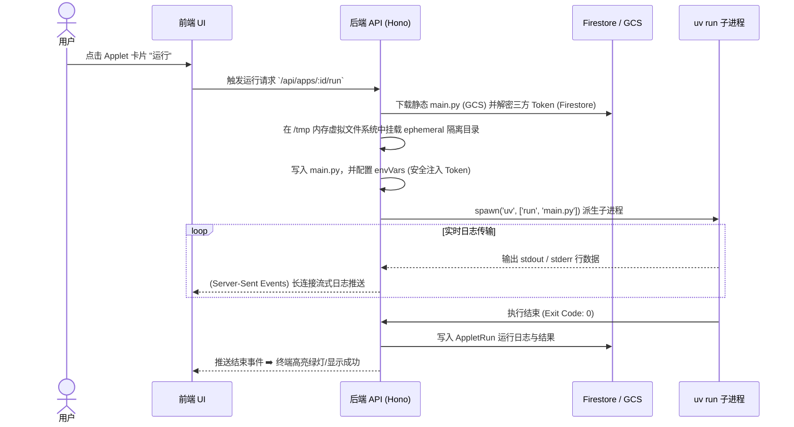

# 系统架构总览 (System Architecture Overview)

本篇文档属于 **Explanation (概念解释)** 类别。它将向您详细阐明智能应用开发平台（Agent Application Platform）的全局架构设计、模块分工、数据流向以及核心安全隔离边界，帮助您在系统层面对本项目建立深刻的理解。

---

## 1. 架构全景与模块分工 (High-Level Architecture)

平台采用前后端分离的 **Monorepo** 架构，包含前端 Web、后端 API 服务以及独立的 Python 智能代理端。为了满足在 **GCP Cloud Run** 这类无服务器（Serverless）容器环境下的秒级水平扩展要求，整个平台采用**完全无状态（Stateless）**的云原生架构设计。

### 1.1 三端分工与核心定位
1. **前端控制台 (apps/web)**：
   * 基于 **React 19 + TanStack Start (SSR)** 框架构建。
   * 提供交互式的 **SaaS 首页**（集成 i18n 语言切换与主题切换）及后台 **Console Dashboard**。
   * 控制台内置双模式切换：管理模式（**Manage Mode**）用于触发卡片；开发模式（**Develop Mode**）内嵌聊天面板，使用 **React Flow** 渲染 Agent 合成的可视化节点步骤。
2. **后端 API 服务 (apps/api)**：
   * 基于 **Hono.js + @hono/node-server**，部署在 GCP Cloud Run。
   * 负责业务元数据读写、三方凭证的安全加解密（**AES-256-GCM**）、沙盒临时目录（`/tmp`）维护。
   * 负责 `child_process.spawn` 派生独立子进程，并建立 **Server-Sent Events (SSE)** 长连接向前端实时流式输出执行终端日志。
3. **AI 代理伴生端 (apps/agent)**：
   * 基于 **ADK-Python (Google DeepMind Agent Development Kit)** 构建。
   * 通过 **FastAPI** 启动一个长存活的本地 Sidecar 服务。Hono.js 后端通过本地端口代理（Local Port Proxy）与其通信，免除了每次对话消息交互都冷启动拉起 Python SDK 的 2s 延迟。

---

## 2. 数据存储与状态模型 (State & Storage Topology)

平台没有选择关系型数据库（如 PostgreSQL），而是选用更轻量、无服务器的 **Google Cloud Firestore + GCS**，以完美对齐 Cloud Run 的 Scale-to-Zero（缩容至零）免运维特性。

### 2.1 平台数据持久化划分

#### A. 白盒文档数据库：Google Cloud Firestore
Firestore 充当应用平台的“白盒”数据中心，维护核心业务结构：
* `sessions`：记录 persistent 会话的最新状态属性。
* `session_events`：按时间轴顺序归档用户与 Agent 对话产生的所有事件（包括普通聊天、UI 授权卡片事件等）。
* `applets`：静态应用的注册卡片元数据（应用名、定制图标、主题色、GCS 代码路径、运行时依赖包列表）。
* `applet_runs`：记录 Applet 的每次执行审计信息（开始时间、完成时间、退出码、异常 Traceback 摘要）。
* `user_credentials`：对用户的敏感 API 密钥和 OAuth Tokens 进行 `AES-256-GCM` 加密后，将密文、初始化向量（`iv`）、以及认证标签（`tag`）落库存储。

#### B. 文件制品存储：Google Cloud Storage (GCS)
* 当 AI 代理成功测试并合成出 standalone 自动化 Python 代码（`main.py`）后，后端 API 会将脚本代码上传并持久化存储在 GCS 桶（路径如 `gs://<bucket-name>/default_user/applet_<appId>/main.py`）中。这解决了 Cloud Run 容器随时销毁和冷启动时的脚本代码分发问题。

### 2.2 Agent 侧的“无状态”设计决策
在 `apps/agent` 端，ADK 代理引擎被配置为使用 **`InMemorySessionService`**。
* **原因**：避免两边写入产生状态脑裂。
* **数据流**：Python 端不进行任何物理数据库的写入。每次 API 对话时，Node.js 负责从 Firestore 中读出该会话历史 `history` 和最新的状态 `state` 字典并打包发送给 Python Sidecar。Python 在内存中完成本轮 ReAct 推理，将新一步的输出和新 `state` 返还给 Node.js，再由 Node.js 显式写入 Firestore。这使得 Python Agent 具备了完全的“无状态伸缩性”。

---

## 3. 核心场景数据流与时序 (Core Workflows & Sequences)

### 3.1 会话合成与代码自愈 (Develop Mode Chat)
当用户在开发模式下提出任务时，AI 代理通过**逐步试跑 ➡️ 报错纠正 ➡️ 最终静态编译**的闭环自愈方式交付代码：

### 3.2 静态应用一键沙盒运行 (Manage Mode Applet Run)
当用户触发已生成的 Applet 时，执行流程是**完全无大模型（LLM-free）**的，仅通过高效的本地子进程执行：

---

## 4. 安全防护与隔离设计 (Security & Sandbox Isolation)

由于生成的 Python 代码包含未知的用户/AI 自行组合的第三方逻辑，系统设计了多重强健的安全防线：

1. **容器级物理防线 (GCP Cloud Run + gVisor)**：
   * 平台部署于 Cloud Run，底层基于 Google **gVisor** 虚拟化容器沙盒。
   * gVisor 能够强力拦截容器内进程向 Linux 物理内核发起的恶意系统调用（Syscalls）。因此，即使生成的 Python 脚本带有恶意木马，它也无法突破容器物理边界。
2. **目录隔离**：
   * 子进程的代码读写操作只能限定在 `/tmp/aquablue-sandbox/` 内根据 `default_user/<appId>` 隔离出的专属工作目录。
3. **120秒生命周期看门狗 (SIGKILL)**：
   * Node.js 在 spawn 子进程时会启动计时器。若 Python 脚本发生死循环或连接挂起，120秒超时后，Node 宿主主进程会向该子进程的进程组发送 `SIGKILL`，强行清空内存，防止 CPU/内存资源耗尽。
4. **敏感日志截断**：
   * 所有在 sandbox 内捕获到的 stdout 和 stderr 日志在通过 SSE 发往前端前，会经过过滤管道（Filter Pipeline），自动检测并屏蔽/截断任何可能包含 OAuth Token 或 API Keys 的字符串，杜绝明文凭证泄露到聊天面板。
5. **破坏性操作二次确认 (Dry-run with Confirmation)**：
   * Agent 拟执行具有 destructive（破坏性，如批量删除）的行为前，必须先执行只读 Dry-run 获取预览卡片，阻塞运行，直到用户在界面中手动点击 "Confirm" 按钮，才允许真正下发写操作，且单次运行严格被限制在 **50 条批处理上限**以内。
